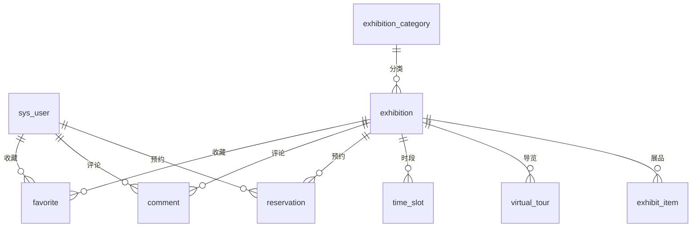
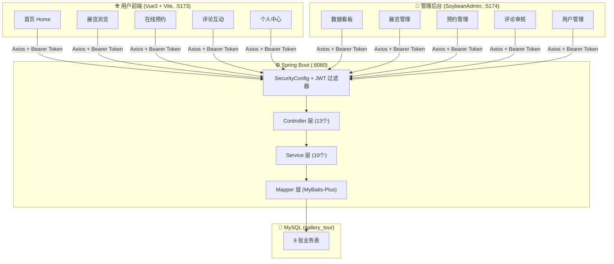
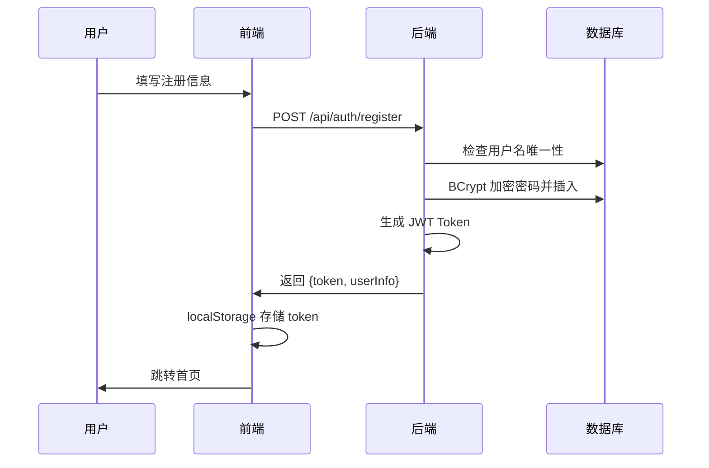
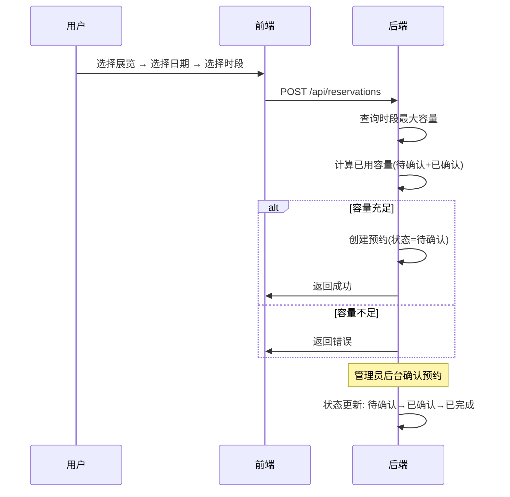

# 光影美术馆在线导览与预约系统 — 毕业设计项目讲解

## 一、项目概述

本系统是一个**前后端分离的三端架构**项目，实现了美术馆展览的在线浏览、虚拟导览、预约参观、评论互动等功能。

| 端 | 技术栈 | 端口 | 说明 |
|---|---|---|---|
| **后端** | Spring Boot 3.5 + MyBatis-Plus + JWT + BCrypt | 8080 | RESTful API 服务 |
| **用户前端** | Vue 3 + Vite + Naive UI + Lucide Icons | 5173 | 普通用户访问 |
| **管理后台** | Vue 3 + Vite + SoybeanAdmin + Naive UI | 5174 | 管理员操作 |
| **数据库** | MySQL 8 (utf8mb4) | 3306 | 数据库名 `gallery_tour` |

---

## 二、数据库设计（9 张表）

> 源文件：[init.sql](file:///Users/itzhan/Desktop/毕业设计/孙晓鹤/backend/sql/init.sql)



| # | 表名 | 说明 | 关键字段 |
|---|---|---|---|
| 1 | `sys_user` | 用户表 | username, password(BCrypt), role(0管理员/1用户), status |
| 2 | `exhibition_category` | 展览分类 | name, sort_order, status |
| 3 | `exhibition` | 展览 | title, category_id, start_date/end_date, ticket_price, status(0草稿/1即将/2展出/3结束), view_count |
| 4 | `exhibit_item` | 展品 | exhibition_id, name, artist, era, audio_url(语音讲解) |
| 5 | `virtual_tour` | 虚拟导览 | exhibition_id, panorama_url, tour_type(0全景/1-3D) |
| 6 | `time_slot` | 预约时段 | exhibition_id, slot_name, start_time/end_time, max_capacity |
| 7 | `reservation` | 预约记录 | user_id, exhibition_id, time_slot_id, reservation_date, status(0待确认/1已确认/2已取消/3已完成/4已过期) |
| 8 | `announcement` | 公告 | title, content, top_flag(置顶), status(0草稿/1已发布) |
| 9 | `comment` | 评论 | user_id, exhibition_id, content, rating(1-5), status(0待审核/1通过/2拒绝) |
| 10 | `favorite` | 收藏 | user_id, exhibition_id (联合唯一约束) |

> 所有表都使用 `deleted` 字段实现**逻辑删除**，配合 MyBatis-Plus `@TableLogic` 注解自动过滤。

---

## 三、后端架构详解

### 3.1 项目分包结构

```
com.gallery
├── GalleryTourApplication.java          // Spring Boot 启动类
├── common/                               // 公共模块
│   ├── Result.java                       // 统一响应封装
│   ├── PageResult.java                   // 分页结果封装
│   ├── BusinessException.java            // 业务异常
│   └── GlobalExceptionHandler.java       // 全局异常处理
├── config/                               // 配置模块
│   ├── CorsConfig.java                   // 跨域配置
│   ├── MybatisPlusConfig.java            // 分页插件配置
│   └── WebMvcConfig.java                 // 静态资源映射
├── security/                             // 安全模块
│   ├── SecurityConfig.java               // Spring Security 配置
│   ├── JwtUtil.java                      // JWT 工具类
│   ├── JwtAuthenticationFilter.java      // JWT 过滤器
│   └── LoginUser.java                    // 登录用户封装
├── entity/                               // 实体层（10 个）
├── dto/                                  // 数据传输对象（11 个）
├── vo/                                   // 视图对象
├── mapper/                               // MyBatis Mapper 接口
├── service/                              // 业务接口（10 个）
│   └── impl/                             // 业务实现（10 个）
└── controller/                           // 控制器（13 个）
```

---

### 3.2 统一响应封装（Result.java）

所有接口返回统一格式 `{ code, msg, data }`：

```java
// 文件: com/gallery/common/Result.java
@Data
public class Result<T> {
    private Integer code;
    private String msg;
    private T data;

    public static <T> Result<T> ok() {
        return new Result<>(200, "success", null);
    }

    public static <T> Result<T> ok(T data) {
        return new Result<>(200, "success", data);
    }

    public static <T> Result<T> error(String msg) {
        return new Result<>(500, msg, null);
    }

    public static <T> Result<T> error(Integer code, String msg) {
        return new Result<>(code, msg, null);
    }
}
```

---

### 3.3 安全认证模块（JWT + Spring Security）

#### SecurityConfig — 安全配置

```java
// 文件: com/gallery/security/SecurityConfig.java
@Configuration
@EnableWebSecurity
@RequiredArgsConstructor
public class SecurityConfig {

    private final JwtAuthenticationFilter jwtAuthenticationFilter;

    @Bean
    public SecurityFilterChain securityFilterChain(HttpSecurity http) throws Exception {
        http
            .csrf(AbstractHttpConfigurer::disable)           // 关闭 CSRF（前后端分离不需要）
            .cors(cors -> {})                                // 启用 CORS
            .sessionManagement(session ->
                session.sessionCreationPolicy(SessionCreationPolicy.STATELESS))  // 无状态会话
            .authorizeHttpRequests(auth -> auth
                .requestMatchers("/api/auth/**", "/api/public/**",
                        "/uploads/**", "/error").permitAll()  // 开放接口
                .anyRequest().authenticated())                // 其余需要认证
            .addFilterBefore(jwtAuthenticationFilter,
                UsernamePasswordAuthenticationFilter.class);  // JWT 过滤器

        return http.build();
    }

    @Bean
    public PasswordEncoder passwordEncoder() {
        return new BCryptPasswordEncoder();  // BCrypt 密码加密
    }
}
```

**设计要点**：
- **无状态认证**：不使用 Session，每次请求通过 JWT 令牌验证身份
- **接口权限分级**：`/api/auth/**` 和 `/api/public/**` 无需登录，其余接口需带 Token

#### JwtUtil — JWT 令牌工具

```java
// 文件: com/gallery/security/JwtUtil.java
@Component
public class JwtUtil {

    private final SecretKey key;
    private final long expiration;

    public JwtUtil(@Value("${gallery.jwt.secret}") String secret,
                   @Value("${gallery.jwt.expiration}") long expiration) {
        this.key = Keys.hmacShaKeyFor(secret.getBytes(StandardCharsets.UTF_8));
        this.expiration = expiration;
    }

    // 生成 Token，携带 userId 和 role
    public String generateToken(Long userId, String username, Integer role) {
        return Jwts.builder()
                .subject(username)
                .claim("userId", userId)
                .claim("role", role)
                .issuedAt(new Date())
                .expiration(new Date(System.currentTimeMillis() + expiration))
                .signWith(key)
                .compact();
    }

    // 从 Token 解析 userId
    public Long getUserIdFromToken(String token) {
        return parseClaims(token).get("userId", Long.class);
    }

    // 验证 Token 有效性
    public boolean validateToken(String token) {
        try { parseClaims(token); return true; }
        catch (Exception e) { return false; }
    }
}
```

---

### 3.4 用户模块（注册/登录/管理）

#### 实体类 User

```java
// 文件: com/gallery/entity/User.java
@Data
@TableName("sys_user")
public class User {
    private Long id;
    private String username;
    @JsonIgnore
    private String password;       // 序列化时隐藏密码
    private String nickname;
    private String phone;
    private String email;
    private String avatar;
    private Integer gender;        // 0未知 1男 2女
    private Integer role;          // 0管理员 1普通用户
    private Integer status;        // 0禁用 1正常
    private LocalDateTime createTime;
    private LocalDateTime updateTime;
    @JsonIgnore @TableLogic
    private Integer deleted;       // 逻辑删除
}
```

#### 用户服务核心逻辑

```java
// 文件: com/gallery/service/impl/UserServiceImpl.java

// ---- 登录 ----
public LoginVO login(LoginDTO dto) {
    User user = userMapper.selectOne(
        new LambdaQueryWrapper<User>().eq(User::getUsername, dto.getUsername()));
    if (user == null) throw new BusinessException("用户名或密码错误");
    if (!passwordEncoder.matches(dto.getPassword(), user.getPassword()))
        throw new BusinessException("用户名或密码错误");
    if (user.getStatus() == 0) throw new BusinessException("账号已被禁用");

    String token = jwtUtil.generateToken(user.getId(), user.getUsername(), user.getRole());
    // 封装 LoginVO 返回 token + 用户信息
    LoginVO vo = new LoginVO();
    vo.setToken(token);
    vo.setUserId(user.getId());
    vo.setUsername(user.getUsername());
    vo.setNickname(user.getNickname());
    vo.setRole(user.getRole());
    return vo;
}

// ---- 注册 ----
public LoginVO register(RegisterDTO dto) {
    // 检查用户名唯一性
    Long count = userMapper.selectCount(
        new LambdaQueryWrapper<User>().eq(User::getUsername, dto.getUsername()));
    if (count > 0) throw new BusinessException("用户名已存在");

    User user = new User();
    user.setUsername(dto.getUsername());
    user.setPassword(passwordEncoder.encode(dto.getPassword()));  // BCrypt 加密
    user.setNickname(dto.getNickname());
    user.setRole(1);   // 默认普通用户
    user.setStatus(1);  // 默认启用
    userMapper.insert(user);
    // 注册成功后自动登录，返回 token
    ...
}

// ---- 修改密码 ----
public void changePassword(Long id, PasswordDTO dto) {
    User user = userMapper.selectById(id);
    if (!passwordEncoder.matches(dto.getOldPassword(), user.getPassword()))
        throw new BusinessException("原密码错误");
    user.setPassword(passwordEncoder.encode(dto.getNewPassword()));
    userMapper.updateById(user);
}

// ---- 管理员重置密码 ----
public void resetPassword(Long id) {
    user.setPassword(passwordEncoder.encode("123456"));  // 重置为默认密码
    userMapper.updateById(user);
}
```

#### 认证 Controller

```java
// 文件: com/gallery/controller/AuthController.java
@RestController
@RequestMapping("/api/auth")
public class AuthController {

    @PostMapping("/login")
    public Result<LoginVO> login(@Valid @RequestBody LoginDTO loginDTO) {
        return Result.ok(userService.login(loginDTO));
    }

    @PostMapping("/register")
    public Result<LoginVO> register(@Valid @RequestBody RegisterDTO registerDTO) {
        return Result.ok(userService.register(registerDTO));
    }

    @GetMapping("/info")
    public Result<User> info() {
        // 从 SecurityContext 获取当前登录用户
        LoginUser loginUser = (LoginUser) SecurityContextHolder
            .getContext().getAuthentication().getPrincipal();
        return Result.ok(userService.getById(loginUser.getId()));
    }
}
```

---

### 3.5 展览模块（CRUD + 浏览量统计）

```java
// 文件: com/gallery/entity/Exhibition.java
@Data
@TableName("exhibition")
public class Exhibition {
    private Long id;
    private String title;
    private String description;
    private String coverImage;
    private String images;          // JSON 数组存储多图
    private Long categoryId;
    private String location;
    private String hallName;
    private LocalDate startDate;
    private LocalDate endDate;
    private Integer dailyCapacity;
    private BigDecimal ticketPrice;
    private Integer status;         // 0草稿 1即将开展 2展出中 3已结束
    private Integer viewCount;

    @TableField(exist = false)
    private String categoryName;    // 非数据库字段，关联查询填充
}
```

```java
// 文件: com/gallery/service/impl/ExhibitionServiceImpl.java

// 查看详情时自动增加浏览量
public Exhibition getById(Long id) {
    Exhibition exhibition = exhibitionMapper.selectById(id);
    if (exhibition == null) throw new BusinessException("展览不存在");
    // SQL: SET view_count = view_count + 1（原子操作，避免并发问题）
    exhibitionMapper.update(null,
        new LambdaUpdateWrapper<Exhibition>()
            .eq(Exhibition::getId, id)
            .setSql("view_count = view_count + 1"));
    return exhibition;
}

// 分页查询（联表查分类名）
public PageResult<Exhibition> listExhibitions(Integer page, Integer size,
        String title, Long categoryId, Integer status) {
    IPage<Exhibition> result = exhibitionMapper.selectPageWithCategory(
        new Page<>(page, size), title, categoryId, status);
    return new PageResult<>(result.getRecords(), result.getTotal(), page, size);
}
```

---

### 3.6 预约模块（核心业务 — 容量校验 + 状态机）

```java
// 文件: com/gallery/service/impl/ReservationServiceImpl.java

// ---- 创建预约（包含容量校验）----
public void create(Long userId, ReservationDTO dto) {
    TimeSlot slot = timeSlotMapper.selectById(dto.getTimeSlotId());
    if (slot == null) throw new BusinessException("时间段不存在");

    // 计算已用容量 = 该时段 + 该日期的所有"待确认 + 已确认"预约的总人数
    int usedCapacity = getUsedCapacity(dto.getTimeSlotId(), dto.getReservationDate());
    int available = slot.getMaxCapacity() - usedCapacity;
    if (dto.getNumVisitors() > available)
        throw new BusinessException("该时间段剩余容量不足，当前可预约人数：" + available);

    Reservation reservation = new Reservation();
    reservation.setUserId(userId);
    reservation.setExhibitionId(dto.getExhibitionId());
    reservation.setTimeSlotId(dto.getTimeSlotId());
    reservation.setReservationDate(dto.getReservationDate());
    reservation.setNumVisitors(dto.getNumVisitors());
    reservation.setContactName(dto.getContactName());
    reservation.setContactPhone(dto.getContactPhone());
    reservation.setStatus(0);  // 初始状态：待确认
    reservationMapper.insert(reservation);
}

// ---- 预约状态机 ----
// 待确认(0) → 确认 → 已确认(1) → 完成 → 已完成(3)
// 待确认(0) / 已确认(1) → 取消 → 已取消(2)

public void confirm(Long id) {
    Reservation r = reservationMapper.selectById(id);
    if (r.getStatus() != 0) throw new BusinessException("只能确认待确认的预约");
    r.setStatus(1);
    reservationMapper.updateById(r);
}

public void cancel(Long userId, Long id, String reason) {
    Reservation r = reservationMapper.selectById(id);
    if (userId != null && !r.getUserId().equals(userId))
        throw new BusinessException("无权取消该预约");
    if (r.getStatus() != 0 && r.getStatus() != 1)
        throw new BusinessException("当前状态不可取消");
    r.setStatus(2);
    r.setCancelReason(reason);
    reservationMapper.updateById(r);
}

// 容量计算方法
private int getUsedCapacity(Long timeSlotId, LocalDate date) {
    List<Reservation> reservations = reservationMapper.selectList(
        new LambdaQueryWrapper<Reservation>()
            .eq(Reservation::getTimeSlotId, timeSlotId)
            .eq(Reservation::getReservationDate, date)
            .in(Reservation::getStatus, Arrays.asList(0, 1)));  // 只统计有效预约
    return reservations.stream().mapToInt(Reservation::getNumVisitors).sum();
}
```

---

### 3.7 Dashboard 统计模块

```java
// 文件: com/gallery/service/impl/ReservationServiceImpl.java

public DashboardVO getDashboard() {
    DashboardVO vo = new DashboardVO();
    vo.setTotalUsers(userMapper.selectCount(null));           // 总用户数
    vo.setTotalExhibitions(exhibitionMapper.selectCount(null)); // 总展览数
    vo.setTotalReservations(reservationMapper.selectCount(null)); // 总预约数
    vo.setTodayReservations(reservationMapper.selectCount(      // 今日预约
        new LambdaQueryWrapper<Reservation>()
            .eq(Reservation::getReservationDate, LocalDate.now())));
    vo.setTotalComments(commentMapper.selectCount(null));       // 总评论数
    // 总浏览量 = 所有展览 viewCount 之和
    List<Exhibition> exhibitions = exhibitionMapper.selectList(null);
    long totalVisits = exhibitions.stream()
        .mapToLong(e -> e.getViewCount() != null ? e.getViewCount() : 0).sum();
    vo.setTotalVisits(totalVisits);
    return vo;
}
```

---

### 3.8 其他后端模块一览

| 模块 | Controller | Service | 核心功能 |
|---|---|---|---|
| 展品管理 | `ExhibitItemController` | `ExhibitItemService` | 展品 CRUD，按展览分组 |
| 虚拟导览 | `VirtualTourController` | `VirtualTourService` | 全景/3D 资源管理 |
| 时间段管理 | `TimeSlotController` | `TimeSlotService` | 预约时段 CRUD |
| 评论管理 | `CommentController` | `CommentService` | 发表评论 + 审核(通过/拒绝) |
| 收藏管理 | `FavoriteController` | `FavoriteService` | 用户收藏/取消收藏展览 |
| 公告管理 | `AnnouncementController` | `AnnouncementService` | 公告 CRUD + 置顶 |
| 展览分类 | `ExhibitionCategoryController` | `ExhibitionCategoryService` | 分类 CRUD |
| 文件上传 | `FileController` | — | 图片文件上传到 uploads 目录 |
| 个人中心 | `ProfileController` | — | 修改资料/密码 |
| 公开接口 | `PublicController` | — | 不需要登录的展览/公告查询 |

---

## 四、前端用户端详解

### 4.1 技术框架

| 技术 | 版本 | 用途 |
|---|---|---|
| Vue 3 | Composition API + `<script setup>` | 核心框架 |
| Vite | — | 构建工具 |
| Naive UI | — | UI 组件库 |
| Axios | — | HTTP 请求 |
| Vue Router | 4.x | 路由管理 |
| Pinia | — | 状态管理 |
| Lucide Icons | — | 图标库 |

### 4.2 页面结构

| 页面文件 | 路由 | 功能描述 |
|---|---|---|
| `Home.vue` | `/` | 首页（Hero 区 + 精选展览 + 公告 + 特色展示） |
| `ExhibitionList.vue` | `/exhibitions` | 展览列表（分类筛选 + 分页） |
| `ExhibitionDetail.vue` | `/exhibitions/:id` | 展览详情（展品 + 虚拟导览 + 预约 + 评论） |
| `Login.vue` | `/login` | 登录/注册 |
| `Profile.vue` | `/profile` | 个人中心（资料修改 + 我的预约 + 我的收藏） |
| `AnnouncementList.vue` | `/announcements` | 公告列表 |
| `AnnouncementDetail.vue` | `/announcements/:id` | 公告详情 |
| `NotFound.vue` | `/:path(.*)` | 404 页面 |

### 4.3 Axios 请求封装

```typescript
// 文件: frontend/src/utils/request.ts
const request = axios.create({
  baseURL: '/api',
  timeout: 15000
})

// 请求拦截 — 自动附加 JWT Token
request.interceptors.request.use(config => {
  const token = localStorage.getItem('token')
  if (token) {
    config.headers.Authorization = `Bearer ${token}`
  }
  return config
})

// 响应拦截 — 统一错误处理
request.interceptors.response.use(
  response => {
    const res = response.data
    if (res.code === 200) return res
    // 业务错误 → 事件通知
    window.dispatchEvent(new CustomEvent('app-error', { detail: res.message }))
    return Promise.reject(new Error(res.message))
  },
  error => {
    if (error.response?.status === 401) {
      // Token 过期 → 清除登录态 → 跳转登录页
      localStorage.removeItem('token')
      window.location.href = '/login'
    }
    return Promise.reject(error)
  }
)
```

### 4.4 首页组件设计（Home.vue 核心逻辑）

```vue
<!-- 文件: frontend/src/views/Home.vue -->
<script setup lang="ts">
import { ref, onMounted } from 'vue'
import { getExhibitions, getAnnouncements, getCategories } from '@/api/public'

const exhibitions = ref<any[]>([])
const announcements = ref<any[]>([])

onMounted(async () => {
  // 并发加载展览、公告、分类数据
  const [exRes, annRes, catRes] = await Promise.all([
    getExhibitions({ page: 1, size: 6 }),
    getAnnouncements({ page: 1, size: 5 }),
    getCategories()
  ])
  
  // 将分类 ID 映射为分类名称
  const catMap: Record<number, string> = {}
  catRes.data.forEach((c: any) => { catMap[c.id] = c.name })
  
  exhibitions.value = exRes.data.records.map((e: any) => ({
    ...e,
    categoryName: catMap[e.categoryId] || ''
  }))
  announcements.value = annRes.data.records
})
</script>
```

---

## 五、管理后台详解

### 5.1 基于 SoybeanAdmin 框架

管理后台使用 **SoybeanAdmin**（一款基于 Vue 3 + Naive UI 的企业级管理后台模板），包含以下管理页面：

| 模块目录 | 功能 |
|---|---|
| `views/gallery/exhibition/` | 展览管理（增删改查 + 状态管理） |
| `views/gallery/category/` | 分类管理 |
| `views/gallery/exhibit-item/` | 展品管理 |
| `views/gallery/virtual-tour/` | 虚拟导览管理 |
| `views/gallery/time-slot/` | 预约时段管理 |
| `views/gallery/reservation/` | 预约管理（确认/完成/查看） |
| `views/gallery/comment/` | 评论审核（通过/拒绝） |
| `views/gallery/announcement/` | 公告管理 |
| `views/gallery/user/` | 用户管理（启用/禁用/重置密码） |
| `views/gallery/favorite/` | 收藏管理 |
| `views/dashboard/` | 数据看板（统计面板） |

---

## 六、系统架构图



---

## 七、核心业务流程

### 7.1 用户注册登录流程



### 7.2 预约流程



---

## 八、关键技术点总结

| 技术点 | 实现方式 | 论文章节建议 |
|---|---|---|
| 身份认证 | JWT 无状态认证 + BCrypt 密码加密 | 系统安全设计 |
| 权限控制 | Spring Security + 接口级白名单 | 系统安全设计 |
| ORM 框架 | MyBatis-Plus（LambdaQueryWrapper + 分页插件 + 逻辑删除） | 持久层设计 |
| 统一响应 | Result\<T\> 泛型封装 | 接口规范设计 |
| 全局异常 | @ControllerAdvice + BusinessException | 异常处理设计 |
| 前端架构 | Vue 3 Composition API + Pinia 状态管理 | 前端架构设计 |
| HTTP 封装 | Axios 拦截器（自动 Token + 统一错误处理） | 前端网络通信 |
| 预约容量控制 | 实时计算已用容量 + 乐观检查 | 核心业务逻辑 |
| 浏览量统计 | SQL 原子操作 `view_count = view_count + 1` | 数据统计设计 |
| 部署方案 | Docker Compose 一键部署（后端 + 前端 + 管理端 + MySQL） | 系统部署 |
